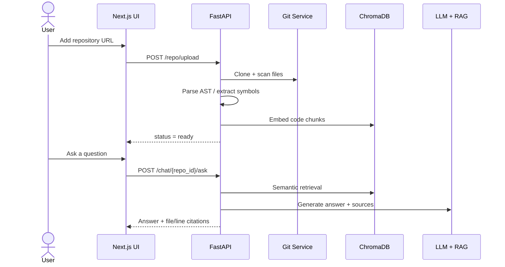

# GitHub Intelligence Platform
**AI-powered platform for understanding, analyzing, and querying GitHub repositories—fast, traceable, and source-backed.**

[](LICENSE)
[](https://www.python.org/downloads/)
[](https://nodejs.org/)
[](https://fastapi.tiangolo.com/)
[](https://nextjs.org/)
[](https://docs.docker.com/compose/)

> Turn raw GitHub repositories into searchable intelligence with structured analysis, semantic retrieval, dependency graphs, and code-quality insights.

---

## Table of Contents
- [Demo](#demo)
- [Screenshots](#screenshots)
- [Features](#features)
- [Supported Languages](#supported-languages)
- [Tech Stack](#tech-stack)
- [Architecture](#architecture)
- [Quick Start](#quick-start)
- [Upload & Query Workflow](#upload--query-workflow)
- [API Reference](#api-reference)
- [Environment Variables](#environment-variables)
- [Data Persistence & Deletion Semantics](#data-persistence--deletion-semantics)
- [Security Notes](#security-notes)
- [Troubleshooting](#troubleshooting)
- [FAQ](#faq)
- [Project Structure](#project-structure)
- [Contributing](#contributing)
- [License](#license)

---

## Demo

<p align="center">
  
</p>

<p align="center">
  <em>End-to-end flow: clone a repository, build embeddings, run analysis, then chat with traceable code citations.</em>
</p>

### How it works (60 seconds)



### Optional: replace with a real screen recording

Drop a short `.gif` or `.mp4` at `docs/assets/demo.gif` (or `demo.mp4`) and uncomment the block below for a live product walkthrough:

<!--
<p align="center">
  
</p>
-->

---

## Screenshots

| Dashboard | Repository Chat |
|:---:|:---:|
|  |  |
| Overview stats, recent repos, and quick actions | Natural-language Q&A with cited source files |

| Analytics | Visualizations |
|:---:|:---:|
|  |  |
| Language breakdown, frameworks, and security signals | Interactive dependency graph (React Flow) |

### UI routes (for your own captures)

When the stack is running locally, these pages map to the screenshots above:

| View | URL |
|---|---|
| Dashboard | `http://localhost:3000/` |
| Repositories | `http://localhost:3000/repositories` |
| Repo overview | `http://localhost:3000/repositories/{id}` |
| Explorer | `http://localhost:3000/repositories/{id}/explorer` |
| Chat | `http://localhost:3000/repositories/{id}/chat` |
| Analytics | `http://localhost:3000/repositories/{id}/analytics` |
| Visualizations | `http://localhost:3000/repositories/{id}/visualizations` |

To swap in real PNG/JPG captures later, save files under `docs/assets/` and update the image paths in this section.

## Features

- **Repository Ingestion** — Clone a repository and build a durable index for later analysis and Q&A.
- **Code Parsing (AST-level)** — Use Tree-sitter to extract accurate structure for modules, functions, and code regions.
- **Semantic Search** — Retrieve relevant code chunks from natural language queries (vector similarity + ranking).
- **AI Chat (RAG)** — Ask repository-specific questions and receive context-aware answers with supporting sources.
- **Dependency Visualization** — Render dependency graphs (internal edges + external packages) for fast system understanding.
- **Complexity Analysis** — Compute cyclomatic and cognitive complexity and surface them as metrics and heatmap data.
- **Security Scanning** — Detect common vulnerability patterns and hardcoded secret indicators during analysis.
- **Auto Documentation** — Generate summaries for functions and modules to accelerate onboarding and review.

---

## Supported Languages

Language support is tiered by capability. The platform indexes a broad set of file types; parsing depth varies by language.

### Parsing & structure extraction

| Tier | Languages | What you get |
|---|---|---|
| **Deep (AST)** | Python | Classes, functions, imports, exports, API route decorators, LOC |
| **Enhanced (pattern-based)** | JavaScript, TypeScript (`.js`, `.jsx`, `.ts`, `.tsx`) | Functions, classes, imports/exports, endpoints |
| **Generic** | Go, Rust, Java, C/C++, C#, Ruby, PHP, Swift, Kotlin, Scala | Functions and imports via language-agnostic patterns |

### Indexing & semantic search (embeddings)

These extensions are chunked and embedded for RAG chat and search (in addition to the languages above):

| Category | Extensions |
|---|---|
| Web / UI | `.html`, `.css`, `.scss`, `.vue`, `.svelte` |
| Config / data | `.json`, `.yaml`, `.yml`, `.toml`, `.xml`, `.ini`, `.cfg`, `.env` |
| Docs / scripts | `.md`, `.txt`, `.rst`, `.sh`, `.bash`, `.sql` |

### Analysis & reporting

Language breakdown, framework detection (e.g. FastAPI, Django, React, Next.js, Express), complexity metrics, and security heuristics run across ingested files. Framework hints are inferred from import patterns and project markers.

> **Note:** Tree-sitter is listed in the architecture for AST-oriented analysis; Python uses the built-in `ast` module today, with JS/TS and generic parsers handling other languages. Adding Tree-sitter grammars per language is a natural extension path.

---

## Tech Stack

| Layer | Technology | Purpose |
|---|---|---|
| Backend API | FastAPI (async REST) | Ingestion, parsing, embeddings, analysis, chat, and auth |
| Frontend | Next.js (React) | Dashboard, chat UI, and visualization views |
| Vector Store | ChromaDB | Persist embeddings and serve semantic retrieval |
| Parsing Engine | Tree-sitter | AST extraction to improve chunking and metrics accuracy |
| Embeddings | Sentence Transformers | Generate code & text embeddings |
| Database | PostgreSQL (Docker) / SQLite (default) | Persist repo metadata and user accounts |
| Containerization | Docker + Docker Compose | Reproducible local development and deployments |

---

## Architecture
The system is split into a clear UI-to-API boundary with a dedicated core services layer:

1. **Frontend (Next.js)** renders the dashboard, chat, and visualization views.
2. **Backend (FastAPI)** orchestrates ingestion, parsing, embedding, analysis, and Q&A.
3. **Data layer** persists:
   - repository checkout on disk (`REPOS_DIR`)
   - embeddings in ChromaDB (`CHROMA_PERSIST_DIR`)
   - metadata + auth in the SQL database (`DATABASE_URL`)

```
┌─────────────────────────────────────────────────────────────────┐
│                         Client Browser                          │
└──────────────────────────────┬──────────────────────────────────┘
                               │
                               ▼
┌─────────────────────────────────────────────────────────────────┐
│                     Next.js Frontend (:3000)                    │
│  ┌───────────┐  ┌────────────┐  ┌───────────┐  ┌────────────┐  │
│  │ Dashboard  │  │  Chat UI   │  │  Graphs   │  │  Explorer  │  │
│  └───────────┘  └────────────┘  └───────────┘  └────────────┘  │
└──────────────────────────────┬──────────────────────────────────┘
                               │ REST API
                               ▼
┌─────────────────────────────────────────────────────────────────┐
│                    FastAPI Backend (:8000)                       │
│  ┌──────────┐  ┌───────────┐  ┌───────────┐  ┌──────────────┐  │
│  │ Repo API │  │  Chat API │  │ Analysis  │  │  Auth / JWT  │  │
│  └────┬─────┘  └─────┬─────┘  └─────┬─────┘  └──────────────┘  │
│       │              │              │                            │
│  ┌────▼──────────────▼──────────────▼────────────────────────┐  │
│  │                  Core Services Layer                       │  │
│  │  ┌─────────┐  ┌───────────┐  ┌──────────┐  ┌───────────┐ │  │
│  │  │ Git Ops │  │ Embedding │  │ Parsing  │  │ Security  │ │  │
│  │  └─────────┘  └───────────┘  └──────────┘  └───────────┘ │  │
│  └───────────────────────────────────────────────────────────┘  │
└───────┬──────────────┬──────────────┬───────────────────────────┘
        │              │              │
        ▼              ▼              ▼
   ┌─────────┐   ┌──────────┐   ┌──────────┐
   │PostgreSQL│   │ ChromaDB │   │  Repos   │
   │  (:5432) │   │ (Vector) │   │  (Disk)  │
   └─────────┘   └──────────┘   └──────────┘
```

---

## Quick Start

### Prerequisites

- `Git`
- `Docker` + `Docker Compose` (recommended) OR local Python/Node setup

If running manually:
- `Python 3.13+`
- `Node.js 22+`
- `PostgreSQL 16+` (optional; backend defaults to SQLite unless you override `DATABASE_URL`)

### Option 1: Docker Compose (Recommended)

From the repository root:

```bash
docker compose -f docker/docker-compose.yml up --build
```

After the services start:

- Frontend: `http://localhost:3000`
- Backend: `http://localhost:8000` (Swagger UI: `http://localhost:8000/docs`)

The first run can take a bit longer because containers must be built and dependencies installed.

### Option 2: Manual Setup

#### Backend (FastAPI)

```bash
cd backend

python -m venv venv
source venv/bin/activate  # Linux/macOS

pip install -r requirements.txt

cp .env.example .env
# Update .env (at minimum: JWT_SECRET_KEY; optionally set GITHUB_TOKEN)

uvicorn app.main:app --reload --port 8000
```

Backend base URL:
- `http://localhost:8000/api/v1`

Swagger UI:
- `http://localhost:8000/docs`

#### Frontend (Next.js)

```bash
cd frontend

npm install

# Create (or edit) .env.local:
# NEXT_PUBLIC_API_URL=http://localhost:8000

npm run dev
```

Frontend:
- `http://localhost:3000`

---

## Upload & Query Workflow

From an API perspective, the “happy path” looks like this:

1. **Register / Login** to obtain a JWT access token.
2. **Upload a repository** (`POST /repo/upload`) to start ingestion (clone → parse → embed → analyze).
3. **Poll ingestion status** (`GET /repo/{id}/status`) until the repo is `ready` (status values: `cloning`, `parsing`, `embedding`, `analyzing`, `ready`, `failed`).
4. **Ask questions** (`POST /chat/{repo_id}/ask`) to get context-aware, source-backed answers.
5. **Fetch analysis + visualizations** (summary, complexity, dependencies, and graph data).

### Endpoint Map (by capability)

| Group | Method | Endpoint | What it does |
|---|---|---|---|
| Repositories | `POST` | `/api/v1/repo/upload` | Upload / clone a repository |
| Repositories | `GET` | `/api/v1/repo/{id}/status` | Check ingestion status |
| Repositories | `GET` | `/api/v1/repo/{id}/files` | List repository files |
| Repositories | `GET` | `/api/v1/repo/` | List repositories for the authenticated user |
| Repositories | `DELETE` | `/api/v1/repo/{id}` | Delete repository + associated data |
| Chat | `POST` | `/api/v1/chat/{repo_id}/ask` | Ask a question about a repository |
| Analysis | `GET` | `/api/v1/analysis/{repo_id}/summary` | Repository summary |
| Analysis | `GET` | `/api/v1/analysis/{repo_id}/complexity` | Complexity metrics |
| Analysis | `GET` | `/api/v1/analysis/{repo_id}/dependencies` | Dependency analysis |
| Visualization | `GET` | `/api/v1/viz/{repo_id}/dependency-graph` | Dependency graph data |
| Visualization | `GET` | `/api/v1/viz/{repo_id}/complexity-heatmap` | Complexity heatmap data |
| Auth | `POST` | `/api/v1/auth/register` | Register a new user |
| Auth | `POST` | `/api/v1/auth/login` | Login and receive JWT |

Full reference:
- Swagger UI: `http://localhost:8000/docs`
- [`docs/API.md`](docs/API.md)

### Example: Authenticate + Ingest + Ask

```bash
API_URL="http://localhost:8000/api/v1"

# 1) Login (after registering once, if needed)
TOKEN="$(
  curl -s "$API_URL/auth/login" \
    -H "Content-Type: application/json" \
    -d '{"email":"user@example.com","password":"securepassword123"}' \
  | python -c "import sys, json; print(json.load(sys.stdin)['access_token'])"
)"

# 2) Upload a repository
REPO_ID="$(
  curl -s "$API_URL/repo/upload" \
    -H "Content-Type: application/json" \
    -H "Authorization: Bearer $TOKEN" \
    -d '{"url":"https://github.com/owner/repo","branch":"main"}' \
  | python -c "import sys, json; print(json.load(sys.stdin)['id'])"
)"

# 3) Poll ingestion status
curl -s "$API_URL/repo/$REPO_ID/status" \
  -H "Authorization: Bearer $TOKEN"

# 4) Ask a repository question
curl -s "$API_URL/chat/$REPO_ID/ask" \
  -H "Content-Type: application/json" \
  -H "Authorization: Bearer $TOKEN" \
  -d '{"question":"How does the authentication middleware work?","max_context_chunks":5}'
```

---

## API Reference

Base URL:

- `http://localhost:8000/api/v1`

Authentication:

- Include `Authorization: Bearer <access_token>` for authenticated endpoints.

Rate limiting:

- **100 requests per minute per authenticated user**

Rate limit headers (included in every response):

| Header | Description |
|---|---|
| `X-RateLimit-Limit` | Max requests per window |
| `X-RateLimit-Remaining` | Remaining requests in window |
| `X-RateLimit-Reset` | Seconds until window resets |

For detailed request/response schemas for every endpoint:

- [`docs/API.md`](docs/API.md)

---

## Environment Variables

The backend reads configuration from `backend/.env` (copied from `backend/.env.example`).

### Backend (`backend/.env`)

| Variable | Example value | Description |
|---|---|---|
| `DATABASE_URL` | `sqlite:///./github_intel.db` | Persistence layer for metadata + user accounts |
| `GITHUB_TOKEN` | *(blank)* | Recommended for higher GitHub API limits |
| `JWT_SECRET_KEY` | `your-secret-key-change-in-production` | JWT signing key for authentication |
| `CHROMA_PERSIST_DIR` | `./chroma_data` | Persistent path for embeddings |
| `LLM_MODEL` | `qwen2.5-coder:7b` | Model used for answer generation |
| `EMBEDDING_MODEL` | `all-MiniLM-L6-v2` | Embedding model used for semantic retrieval |
| `REPOS_DIR` | `./repos` | Local directory where repositories are cloned/stored |

### Docker Compose overrides

In `docker/docker-compose.yml`:

- `DATABASE_URL` is set to the Postgres service
- `JWT_SECRET_KEY` is overridden for the container environment
- `CHROMA_PERSIST_DIR` and `REPOS_DIR` are backed by Docker volumes

---

## Data Persistence & Deletion Semantics

To support fast retrieval and consistent visualizations, the platform persists:

- **Repository files** on disk (`REPOS_DIR`)
- **Embeddings** in ChromaDB (`CHROMA_PERSIST_DIR`)
- **Metadata + auth** in the database (`DATABASE_URL`)

Deletion:

- `DELETE /api/v1/repo/{id}` removes the repository artifacts and associated embeddings/analysis outputs.

---

## Security Notes

- **JWT Auth**: authenticated endpoints require `Authorization: Bearer <token>`.
- **Rate limiting**: reduces abuse and limits resource consumption.
- **Token handling**: keep `GITHUB_TOKEN` private; never commit it.
- **Untrusted input**: repository ingestion must be treated as processing untrusted code and file trees.

---

## Troubleshooting

1. **`401 Unauthorized`**: verify the `Authorization: Bearer <token>` header and token validity.
2. **Frontend loads but API fails**: confirm backend is reachable at `http://localhost:8000` and ports aren’t blocked.
3. **Ingestion stuck on `cloning`/`parsing`**: try a smaller repository first and check backend logs for parse errors.
4. **Model/embedding issues**: confirm `LLM_MODEL` and `EMBEDDING_MODEL` in `backend/.env` match what your environment supports.
5. **Docker volume permission errors**: ensure `CHROMA_PERSIST_DIR` / `REPOS_DIR` mounts are writable by the container.
6. **Graph endpoints return empty data**: ensure the repo is `ready` before calling visualization endpoints.

---

## FAQ

<details>
<summary><strong>What repositories can I ingest?</strong></summary>

Any <strong>public</strong> GitHub repository URL you can clone with Git. Private repos require appropriate Git credentials or a `GITHUB_TOKEN` with sufficient access (configure in `backend/.env`).
</details>

<details>
<summary><strong>How long does ingestion take?</strong></summary>

Depends on repository size, file count, and hardware. Small repos (hundreds of files) often finish in under a minute; large monorepos can take several minutes. Poll <code>GET /api/v1/repo/{id}/status</code> until <code>ready</code>.
</details>

<details>
<summary><strong>Do answers include source citations?</strong></summary>

Yes. Chat responses are designed to be <strong>source-backed</strong>: the API returns relevant file paths, line ranges, and relevance scores so you can verify answers in the Explorer or your IDE.
</details>

<details>
<summary><strong>Which database should I use?</strong></summary>

<ul>
<li><strong>Local dev (manual):</strong> SQLite via <code>DATABASE_URL=sqlite:///./github_intel.db</code> (default in <code>.env.example</code>).</li>
<li><strong>Docker Compose:</strong> PostgreSQL 16 (configured automatically in <code>docker/docker-compose.yml</code>).</li>
</ul>
</details>

<details>
<summary><strong>What LLM / embedding models are used?</strong></summary>

Configured via environment variables:

<ul>
<li><code>LLM_MODEL</code> (default: <code>qwen2.5-coder:7b</code>) — answer generation</li>
<li><code>EMBEDDING_MODEL</code> (default: <code>all-MiniLM-L6-v2</code>) — semantic retrieval</li>
</ul>

Ensure your runtime can load or reach these models (local Ollama, Hugging Face, etc., depending on your deployment).
</details>

<details>
<summary><strong>Is my code sent to external services?</strong></summary>

That depends on how you configure the LLM and embedding backends. For air-gapped or on-prem use, point models to local inference and keep <code>GITHUB_TOKEN</code> scoped minimally. Never commit secrets; rotate <code>JWT_SECRET_KEY</code> in shared environments.
</details>

<details>
<summary><strong>Can I use the API without the UI?</strong></summary>

Yes. The full workflow is available via REST (<a href="docs/API.md">API reference</a> and Swagger at <code>/docs</code>). The frontend is optional convenience on top of the same API.
</details>

---

## Project Structure

```
SMART GITHUB AI/
├── backend/                  # FastAPI backend application
│   ├── app/
│   │   ├── main.py           # Application entry point
│   │   ├── api/              # Route handlers
│   │   ├── core/             # Configuration & security
│   │   ├── models/           # SQLAlchemy / Pydantic models
│   │   ├── services/         # Business logic
│   │   │   ├── git_service.py
│   │   │   ├── parser_service.py
│   │   │   ├── embedding_service.py
│   │   │   ├── chat_service.py
│   │   │   └── analysis_service.py
│   │   └── utils/            # Shared utilities
│   ├── requirements.txt
│   └── .env.example
├── frontend/                 # Next.js frontend application
│   ├── src/
│   │   ├── app/              # App router pages
│   │   ├── components/       # React components
│   │   └── lib/              # Utilities & API client
│   ├── package.json
│   └── .env.local (created locally; set NEXT_PUBLIC_API_URL)
├── docker/                   # Docker configuration
│   ├── docker-compose.yml
│   ├── Dockerfile.backend
│   └── Dockerfile.frontend
├── docs/                     # Documentation
│   ├── API.md
│   └── assets/               # README visuals (SVG mockups; add PNG/GIF here)
│       ├── demo-overview.svg
│       ├── screenshot-*.svg
│       └── demo.gif          # optional: your screen recording
├── .gitignore
├── LICENSE
└── README.md
```

---

## Contributing

Contributions are welcome! Please follow these steps:

1. **Fork** the repository
2. **Create** a feature branch (`git checkout -b feature/amazing-feature`)
3. **Commit** your changes (`git commit -m 'Add amazing feature'`)
4. **Push** to the branch (`git push origin feature/amazing-feature`)
5. **Open** a Pull Request

Please make sure to:
- Add/extend tests for new features and edge cases (when applicable).
- Follow existing code style and formatting conventions.
- Update README and API docs for any user-facing behavior change.
- Keep pull requests focused (one logical change per PR).

---

## License

This project is licensed under the MIT License. See the [LICENSE](LICENSE) file for details.

---

<p align="center">Built with purpose by contributors who believe in open-source intelligence.</p>
