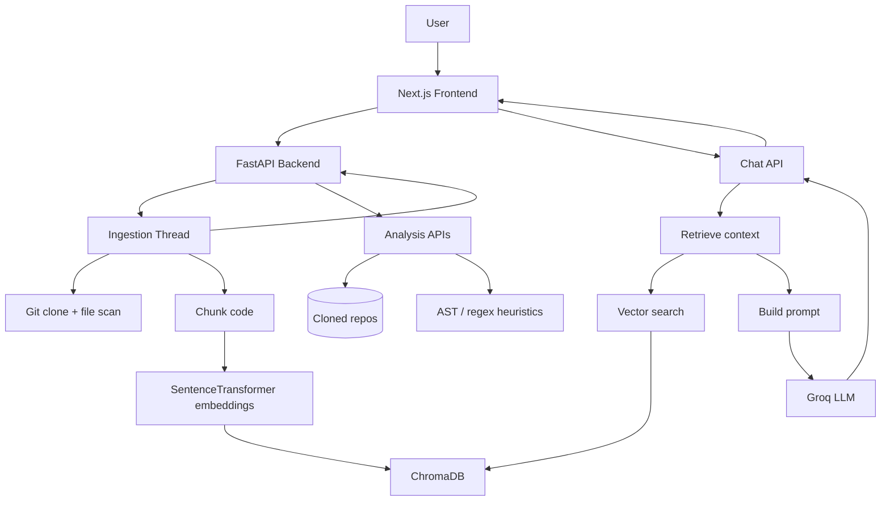
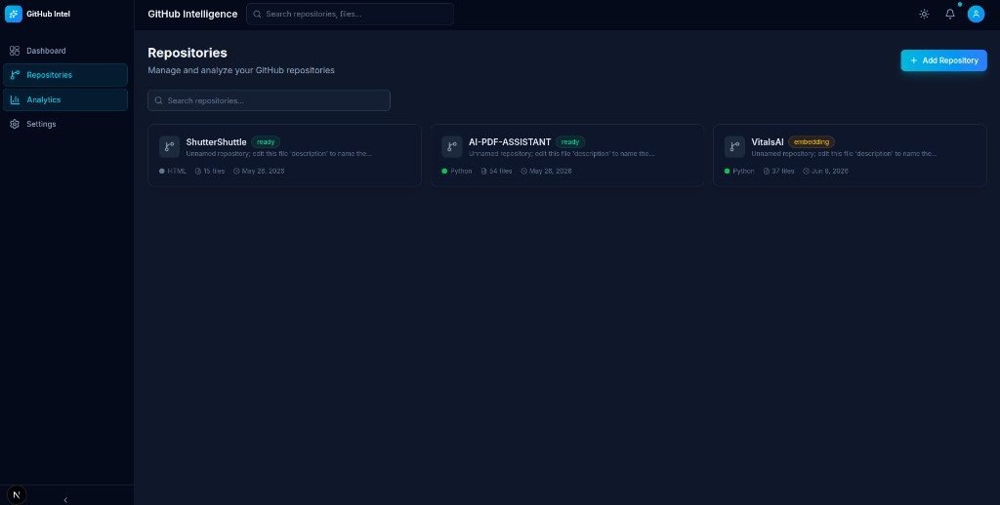
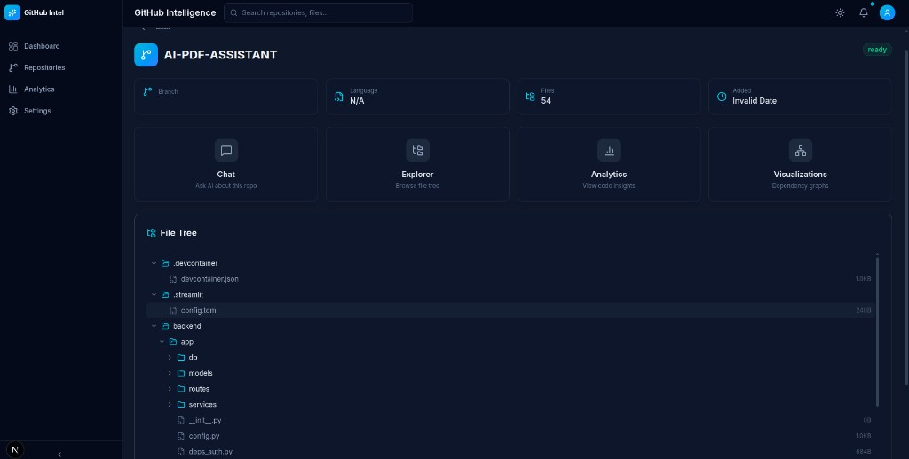
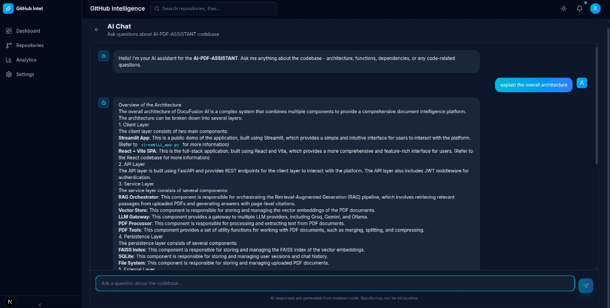
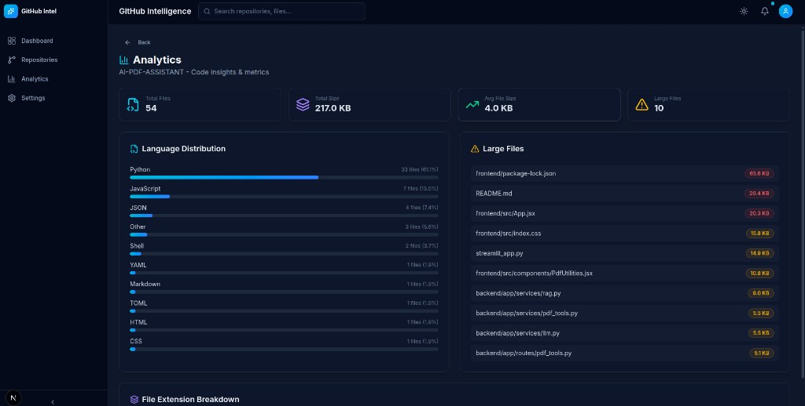
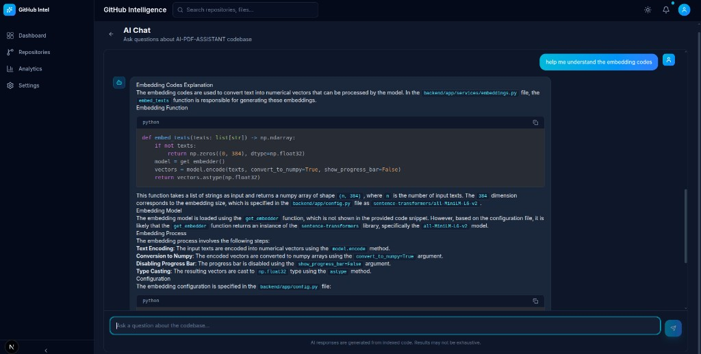
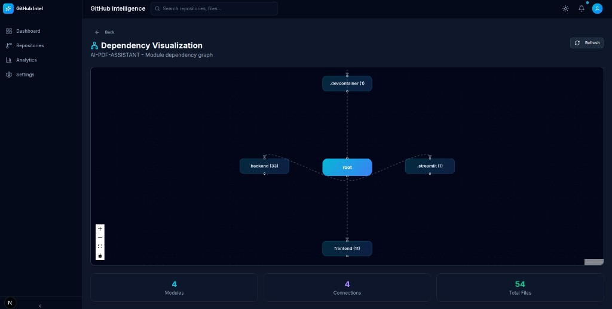

# GitHub Intelligence Platform

**AI-powered repository understanding, code intelligence, and source-backed Q&A — fast, traceable, and built for engineers.**

[](LICENSE)
[](https://fastapi.tiangolo.com/)
[](https://nextjs.org/)
[](https://www.python.org/)

> Ingest a GitHub repository (clone -> chunk -> embed -> index), then ask questions with retrieval-augmented responses grounded in the repository’s source files.

---

## 🚀 Executive Summary

Large codebases are hard to understand quickly: context is distributed across files, dependencies are non-trivial, and the fastest path to “how it works” is usually painful exploration.

The **GitHub Intelligence Platform** turns GitHub repositories into an indexed knowledge base that supports:
- **Repository ingestion** (background clone + chunk + embedding into ChromaDB)
- **Source-backed AI Q&A** via **semantic retrieval + prompt augmentation + Groq LLM**
- **Engineering analytics** (complexity, dependencies, security heuristics, dead-code estimation)

This project is designed for software engineers, researchers, and teams that want **fast, inspectable answers** backed by repository file paths.

---

## 🎯 Key Highlights (What’s Implemented)

| Capability | What it does (grounded in code) | Where it lives |
|---|---|---|
| Repository ingestion | Clones a repo with GitPython, enumerates supported files, stores repo + file metadata in SQLAlchemy models, then generates embeddings from file contents | `backend/app/routers/repository.py`, `backend/app/services/git_service.py`, `backend/app/services/embedding_service.py` |
| Background pipeline + status | Ingestion runs in a background thread and updates `repo.status` through `cloning -> parsing -> embedding -> ready/error` | `backend/app/routers/repository.py` |
| Chunking | Splits file content into chunks using **heuristics around `class` / `def` / `async def` boundaries**, with a line-based fallback + overlap | `backend/app/services/embedding_service.py` |
| Embeddings + vector index | Encodes chunks using `SentenceTransformer(settings.EMBEDDING_MODEL)` and persists embeddings in **ChromaDB** per repository collection `repo_{repo_id}` | `backend/app/services/embedding_service.py` |
| Retrieval-augmented Q&A | Retrieves similar chunks from ChromaDB, then **expands** context with full file contents (within a character budget) before prompting the LLM | `backend/app/services/rag_service.py`, `backend/app/services/llm_service.py` |
| Source citations (current API) | Chat responses return `sources: list[str]` where each source is a **file path** from the retrieved context | `backend/app/routers/chat.py`, `backend/app/services/llm_service.py` |
| Complexity metrics | Computes Python AST-based complexity proxies (function/class counts, branch count, depth, and a score) for `.py` files | `backend/app/services/analysis_service.py` |
| Dependency analysis | Parses dependency manifests (e.g., `requirements.txt`, `package.json`, `go.mod`, `Cargo.toml`) and estimates internal import edges for Python modules | `backend/app/services/analysis_service.py` |
| Security scanning (heuristics) | Scans repository text files line-by-line using regex patterns for hardcoded secrets and unsafe patterns | `backend/app/services/analysis_service.py` |
| Dead-code estimation | Finds potentially unused Python functions by checking whether defined names are referenced in the repo’s AST | `backend/app/services/analysis_service.py` |

---

## 🏗 System Architecture


```mermaid
flowchart TD
  U[User] --> UI[Next.js Frontend]
  UI --> API[FastAPI Backend]

  API --> ING[Ingestion Thread]
  ING --> GIT[Git clone + file scan]
  ING --> CHUNK[Chunk code]
  CHUNK --> EMB[SentenceTransformer embeddings]
  EMB --> CHROMA[ChromaDB]
  ING --> API

  UI --> CHAT[Chat API]
  CHAT --> RET[Retrieve context]
  RET --> SEARCH[Vector search]
  SEARCH --> CHROMA
  RET --> PROMPT[Build prompt]
  PROMPT --> LLM[Groq LLM]
  LLM --> CHAT
  CHAT --> UI

  API --> ANALYSIS[Analysis APIs]
  ANALYSIS --> DISK[(Cloned repos)]
  ANALYSIS --> METRICS[AST / regex heuristics]
```

---

## 🧠 AI & Retrieval Components

| Layer | Implementation details | Configuration |
|---|---|---|
| Chunker | Boundary-based chunking around `class` / `def` / `async def`, else line chunking with `chunk_size` + `overlap` | `backend/app/services/embedding_service.py` |
| Embedding model | `SentenceTransformer(settings.EMBEDDING_MODEL)` | `EMBEDDING_MODEL` |
| Vector store | `chromadb.PersistentClient(path=settings.CHROMA_PERSIST_DIR)` and per-repo collection `repo_{repo_id}` | `CHROMA_PERSIST_DIR` |
| Retrieval | Query embedding + Chroma similarity search; returns chunk docs and converts distance to `score = 1.0 - distance` | `top_k` in `rag_service.retrieve_context` |
| Context expansion | Expands retrieved chunks into **full file contents** if they fit within `MAX_CONTEXT_CHARS` | `MAX_CONTEXT_CHARS = 12000` |
| Prompt building | System prompt instructs the LLM to cite file paths + line numbers; prompt includes labelled code blocks for each context chunk | `rag_service.build_prompt` |
| LLM | Groq Chat Completions endpoint with `temperature=0.3` and `max_tokens=2048` | `GROQ_API_KEY`, `LLM_MODEL` |

---

## ▶ End-to-End Technical Workflow

### Repository ingestion (semantic indexing)

| Step | Action | Code path |
|---|---|---|
| 1 | `POST /api/v1/repo/upload` persists a `Repository` row with `status="cloning"` | `backend/app/routers/repository.py` |
| 2 | Background thread clones the repo and enumerates supported files | `clone_repository()`, `get_file_tree()` |
| 3 | File metadata is stored as `RepositoryFile` rows | `backend/app/routers/repository.py` |
| 4 | Ingestion moves status to `embedding` | `backend/app/routers/repository.py` |
| 5 | Each file is read from disk and chunked | `chunk_code()` + file reading loop |
| 6 | Chunk embeddings are generated and upserted into Chroma per repo collection | `generate_embeddings()` |
| 7 | `repo.status` is set to `ready` (or `error` if the outer thread fails) | `backend/app/routers/repository.py` |

Notes grounded in code:
- `parser_service.parse_repository()` is called during ingestion but its results are not stored and not used to produce embeddings (embeddings are produced from raw file content via `chunk_code`).
- Embedding failures inside the ingestion block may be swallowed by a broad `except Exception: pass`, but the final status is still set to `ready`.

### Question answering (retrieval augmented generation)

| Step | Action | Code path |
|---|---|---|
| 1 | `POST /api/v1/chat/{repo_id}/ask` validates that the repo is `status="ready"` | `backend/app/routers/chat.py` |
| 2 | Retrieve similar chunks from ChromaDB | `rag_service.retrieve_context()` + `embedding_service.search_similar()` |
| 3 | Select context chunks, cap items per file, and expand into full file content within budget | `rag_service.retrieve_context()` |
| 4 | Build a prompt containing labelled code blocks | `rag_service.build_prompt()` |
| 5 | Call Groq LLM and return answer + `sources` as file paths | `llm_service.query_llm()` + `llm_service.ask_about_repo()` |

---

## 🔌 Backend API (Implemented Routes)

Base URL: `http://localhost:8000/api/v1`

### Repository

| Method | Endpoint | Purpose |
|---|---|---|
| `POST` | `/repo/upload` | Clone + index a repository (background ingestion) |
| `GET` | `/repo/` | List repositories |
| `GET` | `/repo/{repo_id}/status` | Current ingestion status |
| `GET` | `/repo/{repo_id}/files` | File tree metadata (path, extension, language, size) |
| `DELETE` | `/repo/{repo_id}` | Remove repo directory + delete SQL rows |

### Chat (RAG)

| Method | Endpoint | Purpose |
|---|---|---|
| `POST` | `/chat/{repo_id}/ask` | Ask a question; returns `answer` and `sources` (file paths) |

### Analysis

| Method | Endpoint | Purpose |
|---|---|---|
| `GET` | `/analysis/{repo_id}/summary` | Repo-level summary + language breakdown + architecture heuristic |
| `GET` | `/analysis/{repo_id}/complexity` | Python file complexity score distribution |
| `GET` | `/analysis/{repo_id}/dependencies` | Dependency manifest extraction + dependency counts |
| `GET` | `/analysis/{repo_id}/security` | Regex-based hardcoded secret + unsafe pattern scanning |
| `GET` | `/analysis/{repo_id}/dead-code` | Potentially unused Python functions via AST reference checks |

### Visualization API (exists; not currently wired into Next.js UI)

| Method | Endpoint | Purpose |
|---|---|---|
| `GET` | `/viz/{repo_id}/dependency-graph` | AST-based Python import graph nodes/edges |
| `GET` | `/viz/{repo_id}/complexity-heatmap` | Heatmap-style complexity rows for `.py` files |

---

## ✨ UI/UX: What the Frontend Shows (and What It Computes)

The Next.js UI is driven by REST calls for ingestion and file metadata, then performs certain visualizations locally from that metadata.

- The **Chat** page calls `POST /chat/{repo_id}/ask` and renders the returned `answer`.
- The **Explorer** page calls `GET /repo/{repo_id}/files` and builds a client-side tree.
- The **Analytics** page computes summary stats locally from the returned `files` (counts, sizes, language distribution, large files, extension breakdown).
- The **Dependency Visualization** page builds a ReactFlow graph from top-level directory names from `files`.

---

## 📸 Screenshots (Captured from the App)

| Dashboard | Explorer | AI Chat |
|---|---|---|
|  |  |  |

| Analytics | Embedding Deep Dive | Dependency Visualization |
|---|---|---|
|  |  |  |

---

## 🧾 Advanced Feature Deep Dive

### Feature: Repository ingestion + semantic indexing

**Problem**: Querying an LLM against raw Git repos is too slow and lacks targeted context.

**Implementation**:
- `backend/app/routers/repository.py` starts a background ingestion thread on `POST /repo/upload`.
- `git_service.clone_repository()` clones the repo.
- `git_service.get_file_tree()` enumerates supported extensions and captures `size`, `language`, and hashes.
- `embedding_service.chunk_code()` chunks file content using heuristics around `class`/`def` boundaries.
- `embedding_service.generate_embeddings()` encodes chunks with SentenceTransformers and writes vectors into ChromaDB.

**Workflow**:
- Poll `GET /repo/{id}/status` until `ready`.
- Use `POST /chat/{repo_id}/ask` for retrieval-augmented answers.

### Feature: Retrieval-augmented chat (Groq LLM)

**Problem**: LLMs must be given relevant code context.

**Implementation**:
- `rag_service.retrieve_context()` uses Chroma similarity search.
- It expands retrieved chunks into full file contents under a strict character budget (`MAX_CONTEXT_CHARS`).
- It formats a labelled prompt (`build_prompt`) and calls `llm_service.query_llm()` (Groq Chat Completions).

**Current citations**:
- The API returns `sources` as a list of file paths corresponding to retrieved context.

### Feature: Engineering analytics

Implemented endpoints under `/analysis/*`:
- `summary`: language breakdown + architecture heuristic via string indicators.
- `complexity`: AST-based complexity proxy for `.py` files.
- `dependencies`: parses supported manifest formats.
- `security`: regex heuristics for hardcoded secrets and unsafe patterns.
- `dead-code`: AST-based potentially unused functions.

---

## ⚙ Configuration

The backend reads settings from `backend/.env` (configured via `pydantic-settings`).

| Variable | Default | Purpose |
|---|---|---|
| `DATABASE_URL` | `sqlite:///./github_intel.db` | SQL database connection string |
| `GITHUB_TOKEN` | *(blank)* | Placeholder for GitHub token (cloning uses GitPython) |
| `JWT_SECRET_KEY` | `your-secret-key-change-in-production` | JWT signing key (auth routes exist; current UI/API calls do not enforce JWT) |
| `CHROMA_PERSIST_DIR` | `./chroma_data` | Chroma persistence directory |
| `GROQ_API_KEY` | *(blank)* | Required for chat (Groq API) |
| `LLM_MODEL` | `llama-3.3-70b-versatile` | Groq model |
| `EMBEDDING_MODEL` | `all-MiniLM-L6-v2` | SentenceTransformer model |
| `REPOS_DIR` | `./repos` | Repo clone directory |

**Note**: `backend/.env.example` does not include `GROQ_API_KEY` — set it manually for chat.

---

## 💾 Data Persistence & Deletion Semantics

- Repo clones persist under `REPOS_DIR`.
- Chroma embeddings persist under `CHROMA_PERSIST_DIR` (per-repo collection `repo_{repo_id}`).
- Metadata persists in `DATABASE_URL`.

`DELETE /api/v1/repo/{id}` removes:
- The repo directory under `REPOS_DIR`
- The SQL rows (repository + repository files)

It does **not** currently delete the corresponding Chroma collection, because `embedding_service.delete_repo_embeddings(repo_id)` is not wired into the delete route.

---

## 🔐 Security & Reliability Notes

Grounded in code:
- Ingestion reads file contents with error-tolerant I/O and ignores decode errors.
- Retrieval expands context with a strict character budget (`MAX_CONTEXT_CHARS`).
- Security scanning is regex-based heuristic detection (`SECRET_PATTERNS` + `UNSAFE_PATTERNS`).

---

## ▶ Installation

### Option 1: Docker Compose (local)

```bash
docker compose -f docker/docker-compose.yml up --build
```

Then:
- Frontend: http://localhost:3000
- Backend: http://localhost:8000 (Swagger: http://localhost:8000/docs)

### Option 2: Manual (backend + frontend)

```bash
# Backend
cd backend
python -m venv venv
source venv/bin/activate
pip install -r requirements.txt

cp .env.example .env
# Set GROQ_API_KEY in backend/.env

uvicorn app.main:app --reload --port 8000

# Frontend
cd ../frontend
npm install
# Create/edit .env.local: NEXT_PUBLIC_API_URL=http://localhost:8000/api/v1
npm run dev
```

---

## 🌍 Free Deployment Options

### Hugging Face Spaces (backend) + Streamlit Cloud (UI)

This repo includes a helper to deploy the backend as a Docker Space:
- `hf-space/Dockerfile`
- `scripts/deploy-hf.sh`

After deploying the backend Space, configure:
- Space secret: `GROQ_API_KEY`
- Streamlit Cloud secret: `API_BASE_URL = "https://<space-name>.hf.space/api/v1"`

### Fully free local experience (backend + public UI)

The repo includes:
- `start-all.sh` (runs backend, Cloudflare tunnel, then Streamlit UI)
- `scripts/expose-backend.sh`

These keep the backend on your machine but expose the UI publicly without Render payment.

---

## 🧠 Why This Project Stands Out

- **Research-driven RAG pipeline** with retrieval + budgeted full-file expansion.
- **Engineering analytics** backed by concrete AST/regex heuristics.
- **Traceability-first UX**: chat returns file paths as sources.
- **Extensible architecture**: ingestion, indexing, retrieval, and analysis are separated into focused services.

---

## 📂 Repository Structure (Tree)

```text
SMART GITHUB AI/
├── backend/
│   ├── app/main.py
│   ├── app/routers/*
│   ├── app/services/*
│   ├── app/models/*
│   └── requirements.txt
├── frontend/
│   └── src/app + src/components + src/lib
├── docs/assets/* (README visuals)
├── docker/docker-compose.yml
├── hf-space/ (HF Spaces Docker files)
├── scripts/ (deploy + tunnel helpers)
├── streamlit_app.py
└── LICENSE
```

---

## 🤝 Contributing

Contributions are welcome.

1. Fork the repository
2. Create a branch
3. Commit changes
4. Open a Pull Request

---

## 📜 License

MIT — see [LICENSE](LICENSE).

<!-- repo-metadata: clean-contributor-history -->
